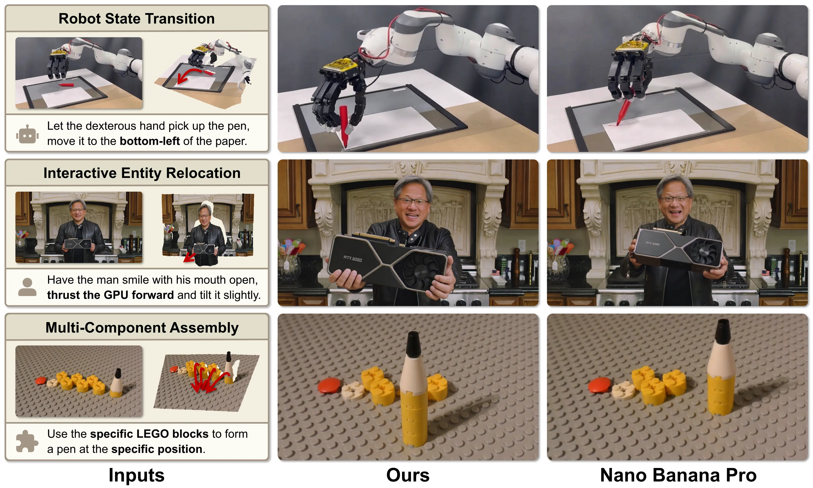

<h1 align="center">
PhyEdit: Towards Real-World Object Manipulation </br> via Physically-Grounded Image Editing
</h1>

<p align="center">
<a href="https://scholar.google.com/citations?user=5ZDU6wwAAAAJ">Ruihang Xu</a>,
<a href="https://scholar.google.com/citations?user=4C_OwWMAAAAJ">Dewei Zhou</a>,
<a href="https://scholar.google.com/citations?user=vAMMc8EAAAAJ">Xiaolong Shen</a>,
<a href="https://scholar.google.com/citations?user=FyglsaAAAAAJ">Fan Ma</a>,
<a href="https://scholar.google.com/citations?user=RMSuNFwAAAAJ">Yi Yang</a><br>
<span>ReLER Lab, CCAI, Zhejiang University</span><br>
</p>

<div align="center">
<a href="https://nenhang.github.io/PhyEdit"></a>
<a href="https://arxiv.org/abs/2604.07230"></a>
</div>

## 📝 Introduction



**PhyEdit** is a framework for **physically-grounded image editing** that allows users to **move and edit objects** freely and precisely in the **3D space** of the imagewith geometric accuracy and physical consistency.

## 🚀 Highlights

- **Physically-Grounded Editing**: **PhyEdit** leverages geometric constraints to ensure physical plausibility.
- **Free and Precise Editing**: Users can manipulate objects via coordinates and natural language prompts in 3D space.
- **Real-World High-Quality Dataset**: **RealManip-10K** is a real-world dataset for physically-grounded object manipulation.
- **Dedicated Benchmark**: **ManipEval** is a benchmark for evaluating the geometric accuracy of object manipulation editing.

## ✅ To-Do List

- [x] [ArXiv Paper](https://arxiv.org/abs/2604.07230)
- [x] [Project Page](https://nenhang.github.io/PhyEdit) (Here are more interesting demos!)
- [ ] Inference and Training Code
- [ ] Dataset and Benchmark
- [ ] Model Weights
- [ ] GUI Support

Code and data will be released soon! Stay tuned! 🤗

## 📭 Citation

If you find PhyEdit helpful to your research, please consider citing our paper:

```bibtex
@misc{xu2026phyeditrealworldobjectmanipulation,
      title={PhyEdit: Towards Real-World Object Manipulation via Physically-Grounded Image Editing}, 
      author={Ruihang Xu and Dewei Zhou and Xiaolong Shen and Fan Ma and Yi Yang},
      year={2026},
      eprint={2604.07230},
      archivePrefix={arXiv},
      primaryClass={cs.CV},
      url={https://arxiv.org/abs/2604.07230}, 
}
```


If you like our work, don't forget to ⭐ our repository! 🤩