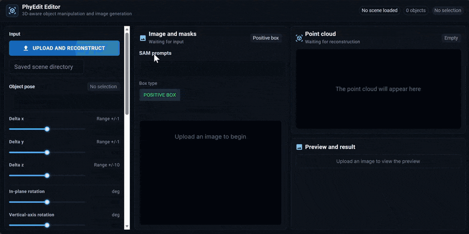

<h1 align="center">
PhyEdit: Towards Real-World Object Manipulation <br> via Physically-Grounded Image Editing
</h1>

<p align="center">
<a href="https://scholar.google.com/citations?user=5ZDU6wwAAAAJ">Ruihang Xu</a>,
<a href="https://scholar.google.com/citations?user=4C_OwWMAAAAJ">Dewei Zhou</a>,
<a href="https://scholar.google.com/citations?user=vAMMc8EAAAAJ">Xiaolong Shen</a>,
<a href="https://scholar.google.com/citations?user=FyglsaAAAAAJ">Fan Ma</a><sup>✉️</sup>,
<a href="https://scholar.google.com/citations?user=RMSuNFwAAAAJ">Yi Yang</a><br>
<span>ReLER Lab, CCAI, Zhejiang University</span><br>
</p>

<div align="center">
<a href="https://nenhang.github.io/PhyEdit"></a>
<a href="https://arxiv.org/abs/2604.07230"></a>
<a href="https://huggingface.co/ruihangxu/PhyEdit"></a>
<a href="https://huggingface.co/datasets/ruihangxu/RealManip-40K"></a>
</div>

## 🔥 Updates

- **2026.07.14**: PhyEdit was accepted by ACM MM 2026! 🎉

## 📝 Introduction


**PhyEdit** is a framework for **physically-grounded image editing** that enables
users to relocate and edit objects freely and precisely in the 3D scene
represented by a real image. It combines geometric movement previews with
Qwen-Image-Edit to improve geometric accuracy and physical consistency.

## 🚀 Highlights

- **Physically-Grounded Editing**: Uses depth, camera geometry, and 3D transformation constraints to improve physical plausibility.
- **Free and Precise Editing**: Supports coordinate-based 3D manipulation together with natural-language editing instructions.
- **Real-World Training Data**: **RealManip-40K** provides 41,154 real-world paired examples for physically-grounded object manipulation.
- **Dedicated Evaluation**: **ManipEval** evaluates geometric accuracy, appearance quality, and physical plausibility in object manipulation editing.

## 📁 Repository Layout

- [`phyedit/`](phyedit/): model, data, pipeline, and geometry implementation. See the [training guide](phyedit/model_deepspeed/README.md).
- [`bench/`](bench/): ManipEval sampling and evaluation. See the [benchmark guide](bench/README.md).
- [`gui/`](gui/): interactive DA3 + SAM geometry editor with final PhyEdit generation. See the [GUI guide](gui/README.md).
- [`scripts/`](scripts/): Depth Anything 3 setup and preview-cache preprocessing. See the [utility guide](scripts/README.md).
- [`configs/`](configs/): DeepSpeed training configuration.

## 🎬 Interactive GUI

Here's a short demo of our interactive GUI, which supports object segmentation,
3D manipulation with live geometric previews, and final image generation using
the PhyEdit checkpoint.

<p align="center">
  
</p>

## 🛠️ Installation

```bash
git clone https://github.com/nenhang/PhyEdit.git
cd PhyEdit

conda create -n phyedit python=3.12 -y
conda activate phyedit

# Install a CUDA-specific PyTorch build first when needed.
pip install -r requirements.txt
bash scripts/setup_depth_anything_3.sh
pip install -e .
```

ManipEval and the GUI have additional dependencies documented in
[bench/README.md](bench/README.md) and [gui/README.md](gui/README.md).
They can share the main PhyEdit environment; only DeQA requires a separate
legacy environment.

## 🖼️ Inference

Request access to [RealManip-40K](https://huggingface.co/datasets/ruihangxu/RealManip-40K),
authenticate with `hf auth login`, and download the public checkpoint and
ManipEval test split:

```bash
hf download ruihangxu/PhyEdit phyedit_lora.safetensors \
  --local-dir checkpoints/PhyEdit

hf download ruihangxu/RealManip-40K \
  --repo-type dataset \
  --include 'LICENSE_DATA.md' \
  --include 'metadata/test*' \
  --include 'data/test/**' \
  --include 'scripts/extract_shards.py' \
  --local-dir data/RealManip-40K

python data/RealManip-40K/scripts/extract_shards.py --split test
```

Generate the standard eight samples for every ManipEval item:

```bash
CUDA_VISIBLE_DEVICES=0 \
python -m bench.sample \
  --config-path configs/train_deepspeed.yaml \
  --pretrained-model-path Qwen/Qwen-Image-Edit-2511 \
  --checkpoint-path checkpoints/PhyEdit/phyedit_lora.safetensors \
  --benchmark-metadata data/RealManip-40K/metadata/test.json \
  --output-dir outputs/manipeval \
  --base-area 589824 \
  --batch-size 8 \
  --seeds 42 43 44 45 46 47 48 49
```

All visible GPUs are used by the sampler. Restrict GPU selection with
`CUDA_VISIBLE_DEVICES`. See [bench/README.md](bench/README.md) for evaluation.

## 📄 License

PhyEdit source code is released under the [Apache License 2.0](LICENSE).
Third-party datasets, packages, APIs, and model weights retain their own terms.
In particular, the default DA3 weights are non-commercial. See
[THIRD_PARTY_NOTICES.md](THIRD_PARTY_NOTICES.md).

## 📝 Citation

If you find PhyEdit helpful to your research, please consider citing our paper:

```bibtex
@misc{xu2026phyeditrealworldobjectmanipulation,
      title={PhyEdit: Towards Real-World Object Manipulation via Physically-Grounded Image Editing},
      author={Ruihang Xu and Dewei Zhou and Xiaolong Shen and Fan Ma and Yi Yang},
      year={2026},
      url={https://arxiv.org/abs/2604.07230},
}
```

If you like our work, don't forget to ⭐ our repository! 🤩
